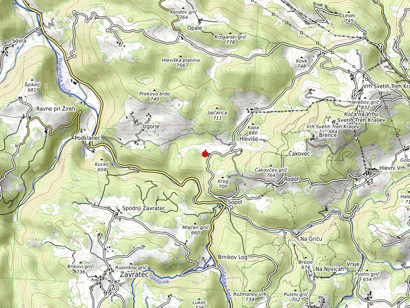
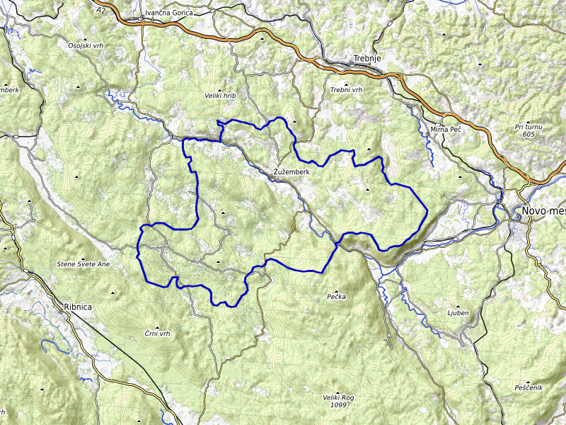

# SPIN112 Incident Reporting Telegram Bot

__[Sample:](https://t.me/nasoncnistranialp)__

## Introduction

This **Telegram bot** is designed to automatically fetch and post incidents from the [SPIN3](https://spin3.sos112.si) RSS system to a designated Telegram supergroup and its topics. The incidents include various emergency situations such as traffic accidents, technical assistance, fire, explosions, and more, when they are reported 🟨 or when checked 🟩.

⚠️ **Disclaimer**: This software is **not affiliated** with or endorsed by the *Uprava Republike Slovenije za zaščito in reševanje* (_en. Administration for Civil Protection and Disaster Relief_). The bot was developed by a **Telegram enthusiast** and is maintained at the author's own cost. Contributions of any kind (feedback, code contributions, donations, etc.) are welcome and greatly appreciated! 

## Features

- Automatically fetches incidents from SPIN3 every 180 sec and posts them to a Telegram supergroup SPIN.
- Supports categorization of incidents by region and intervention type.
- Uses a custom `topics` dictionary to map various keywords in incidents to specific Telegram topics.
- Creates and posts static map images for incidents with GPS coordinates, including:
  - Point markers for individual incident locations as specified in the report.
  - Polygon boundaries for larger incidents (e.g., "Večji obseg" events) to show the manicipality of the major event.
- Posts only new incidents and keeps track of already posted incidents using JSON files.

## Installation

### 1. Clone the repository:

```git clone https://github.com/StellarStoic/SPIN112```

```cd SPIN112```

2. Install the required dependencies:
```pip install -r requirements.txt```
3. Create a .env file:
In the root directory, create a ```.env``` file with the following content:

TELEGRAM_BOT_TOKEN=your_telegram_bot_token
TELEGRAM_GROUP_ID=your_telegram_group_id

__Replace your_telegram_bot_token with your bot token from BotFather and your_telegram_group_id with your Telegram supergroup ID.__

4. Run the bot:
```python SPIN112bot.py```

### Files
```SPIN112bot.py```: Main script to run the bot.
```posted_incidents.json```: Stores IDs of posted incidents to prevent reposting.
```posted_vecjiObseg.json```: Stores posted "Večji obseg" incidents in plain text as json (this events does not have IDs).
```.env```: Environment variables (bot token and group ID).

Example Output
Incident Location Map:



Polygon Map of Incident:



Contributing
This project is maintained at my own cost, and I welcome contributions of any kind. If you have any suggestions, issues, or improvements, feel free to open a pull request or an issue on GitHub.

If you'd like to support the project, reach out to me on Telegram or consider contributing code, documentation, or even a small donation to help with hosting costs.

License
This project is licensed under the MIT License. See the LICENSE file for more details.